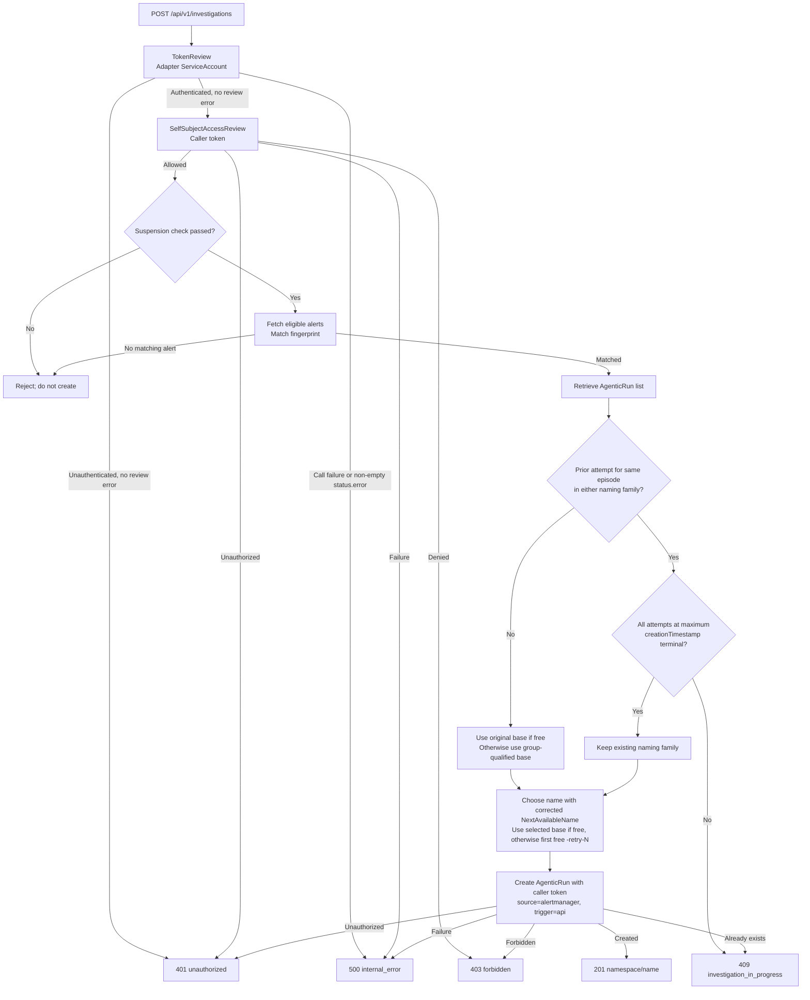

# On-Demand Investigation API

**Status:** Proposed
**Date:** 2026-10-09

## Context

The adapter currently polls Alertmanager and creates `AgenticRun` resources. It has no inbound HTTP API. The UI needs an explicit action to request analysis for a firing alert, including alerts the poller would skip because of its receiver allowlist or delay settings.

The API must use Alertmanager as the source of truth for alert details. The UI supplies only the Alertmanager fingerprint; it does not supply alert labels, annotations, or timestamps.

## Proposed design

Add a small HTTP server to the existing adapter process. It uses the standard library HTTP server, the existing Alertmanager client, the existing `AgenticRun` client, and the existing alert-to-run builder. Add an in-cluster Kubernetes Service for the listener; UI routing and transport configuration are outside this design.

### Authentication, authorization, and creation identity

The API authenticates the request's bearer token by submitting it to Kubernetes `TokenReview` using the adapter's ServiceAccount. The ServiceAccount needs `create` permission on `tokenreviews.authentication.k8s.io`. Leave `spec.audiences` unset to validate against the Kubernetes API server's default audience. After a successful TokenReview call, check `status.error` before `status.authenticated`: a non-empty error fails closed with `500 internal_error`, even if `authenticated=true`, without exposing the error text. Only when `status.error` is empty does `status.authenticated=false` return `401 unauthorized`; an empty error and `status.authenticated=true` permit the following authorization check. Do not proceed to SelfSubjectAccessReview, internal reads, or creation after a TokenReview error or authentication rejection. TokenReview establishes identity; it does not authorize investigation creation.

Before reading suspension state, retrieving alerts, or listing runs, submit a `SelfSubjectAccessReview` using the caller's bearer token. Set `spec.resourceAttributes` to `group=agentic.openshift.io`, `resource=agenticruns`, `verb=create`, and `namespace=<adapter namespace>`. The review checks the authenticated caller automatically; do not accept a requester identity from the request body or metadata. Continue only when `status.allowed=true` and `status.evaluationError` is empty. A completed review with no evaluation error and `allowed=false` returns `403 forbidden`; an evaluation error fails closed with `500 internal_error` even if `allowed=true`. Caller-authenticated review request failures use the error mappings below.

The caller needs permission to create SelfSubjectAccessReviews and to create AgenticRuns in the adapter namespace. Internal reads continue using the adapter's existing credentials, so the caller does not need the adapter's suspension, Alertmanager, or run-listing permissions. The adapter does not need impersonation or SubjectAccessReview permissions for this design.

Use a separate, request-scoped Kubernetes client authenticated only with the caller's bearer token for final AgenticRun creation. Kubernetes rechecks the caller's authorization and applies admission policies to the actual object; the earlier review does not guarantee creation will succeed. Never fall back to ServiceAccount credentials after a caller-authenticated failure. The shared client and poller continue using the adapter's ServiceAccount identity.

Users with this permission can also create AgenticRuns directly through Kubernetes, outside the adapter's request restrictions. This is an accepted consequence of using native create permissions. Equivalent admission controls are needed if any adapter restriction must also govern direct creation.

### Caller credential isolation

Build the caller client from fixed, trusted API-server connection settings with verified TLS and only the request's bearer token. Use `rest.AnonymousClientConfig` as the starting point to remove existing authentication before setting the caller token. Merely copying the ServiceAccount config and changing `BearerToken` is insufficient: `BearerTokenFile` can override it. Do not retain ServiceAccount bearer files, client certificates, basic authentication, authentication providers, exec plugins, impersonation settings, or credential-bearing transport wrappers. Reuse trusted schema/REST mapping independently of authentication to avoid requiring caller-side discovery beyond the intended operations.

Never mutate the shared client or configuration, or cache/reuse token-bearing caller clients across requests. Keep the token scoped to the request; do not persist it, log it, or forward it to Alertmanager or any caller-selected destination. Client-to-adapter transport must also protect the bearer token, although UI routing and transport deployment details remain outside this design.

## HTTP contract

- `POST /api/v1/investigations`
- Request body: `{"fingerprint":"<Alertmanager fingerprint>"}`
- Missing or invalid caller authentication returns `401 Unauthorized` with error code `unauthorized`, except that non-empty `TokenReview.status.error` takes precedence and returns `500 internal_error`. A `401` from caller-authenticated review or creation also returns `401 unauthorized`.
- An early authorization denial or a `403` from caller-authenticated review or creation returns `403 Forbidden` with error code `forbidden`.
- On creation using the caller's token, return `201 Created` with `{"namespace":"<run namespace>","name":"<run name>"}`.
- If cluster suspension is enabled, return `403 Forbidden` with error code `investigations_suspended`.
- If the fingerprint does not match an eligible current alert, return `404 Not Found` with error code `alert_not_found`.
- For existing `AgenticRun` attempts of the same alert episode, consider all attempts with the maximum `metadata.creationTimestamp`. Allow a manual retry using the hash-preserving retry naming rule below only if all those attempts are terminal. If any is non-terminal, return `409 Conflict` with error code `investigation_in_progress`.
- A base name occupied by a different alert group does not count as an existing attempt for the requested group. Select a deterministic group-qualified name as specified below instead of reusing that occupied base name.

Only the fingerprint is accepted from the caller. The adapter retrieves and uses the canonical alert returned by Alertmanager.

### Error responses

Handler-generated errors use a consistent JSON structure with a stable machine-readable `code` and a human-readable `message`. Clients should use `code` for programmatic handling rather than matching message text. All handler-generated server/dependency failures return `500 Internal Server Error` with this response:

```json
{
  "error": {
    "code": "internal_error",
    "message": "An internal error occurred"
  }
}
```

The following status codes, error identifiers, and messages are fixed:

| Condition | HTTP | `code` | `message` |
|---|---|---|---|
| Malformed JSON, unknown fields, non-whitespace trailing data, or a missing/empty/non-string fingerprint | 400 | `invalid_request` | Request must contain only a non-empty fingerprint string |
| Missing/malformed bearer authentication, TokenReview rejects authentication with an empty `status.error`, or caller-authenticated review/creation returns `401` | 401 | `unauthorized` | A valid bearer token is required |
| Early authorization review denies creation, or caller-authenticated review/creation returns `403` | 403 | `forbidden` | You are not allowed to trigger investigations |
| No eligible alert matches the fingerprint | 404 | `alert_not_found` | No eligible alert matches the fingerprint |
| Request-body read timeout | 408 | `request_timeout` | Timed out while reading the request |
| Cluster suspension enabled | 403 | `investigations_suspended` | Investigations are suspended |
| Any same-episode attempt at the maximum creation timestamp is non-terminal, or Kubernetes reports `AlreadyExists` | 409 | `investigation_in_progress` | An investigation already exists |
| Request body exceeds the size limit | 413 | `request_too_large` | Request body exceeds the size limit |
| Any handler-generated server/dependency failure, including request/upstream deadline expiry | 500 | `internal_error` | An internal error occurred |

Handler-generated JSON responses use `Content-Type: application/json`. A `401` response also includes `WWW-Authenticate: Bearer`. The `403 forbidden` response covers an early permission denial or a forbidden caller-authenticated Kubernetes request, including admission denial during creation. The `403 investigations_suspended` response indicates that cluster policy disables investigations, not that the caller lacks permission.

TokenReview call failures using adapter credentials, completed TokenReview responses with non-empty `status.error`, suspension-read failures other than missing CRD/singleton, Alertmanager retrieval failures, run-building failures, and ServiceAccount-authenticated run-listing failures all use the generic `500` response. A successful HTTP response from TokenReview does not override an error reported in its body. SelfSubjectAccessReview evaluation errors and review/creation request failures other than caller `401`/`403` or creation `AlreadyExists` also use this response. Do not classify an authentication or permission failure of the adapter's own credentials as a caller `401` or `403`. Handler-reported request/upstream deadline expiry uses the generic `500` response. The `500` response must not expose the failure reason, upstream identifiers, or diagnostic details. No error response may contain bearer tokens or raw upstream response bodies. A `500` during creation does not establish that no run was created; a timed-out Kubernetes create may already have succeeded.

Errors generated before the handler, such as oversized headers (`431`), may use standard HTTP responses rather than the JSON structure. Disconnected clients may receive no response.

### Request constraints

- Bound request body and total header sizes. Enforce the body limit before JSON decoding.
- Accept exactly one JSON object with a required, non-empty string `fingerprint`. Reject unknown fields, malformed JSON, and non-whitespace trailing data.
- Configure finite header/body read, response write, and idle timeouts on the HTTP server.
- Apply one finite per-request deadline, preserving caller cancellation, to TokenReview, SelfSubjectAccessReview, suspension reads, Alertmanager retrieval, and AgenticRun listing/creation. Do not start internal reads or creation after authentication/authorization fails. Do not start creation after validation or a preceding upstream step fails, the deadline expires, or the request is cancelled.
- Return validation and upstream failures using the JSON error structure when a response can still be sent. HTTP parsing errors or connection timeouts may prevent a handler-generated response.

Numerical limits and timeout defaults will be selected during implementation planning.

## Request flow



The API path bypasses the poller's receiver allowlist, pre-run and post-run delays, and in-memory creation backoff. For an existing episode, all attempts at the maximum creation timestamp must be terminal to permit a manual retry. Earlier attempts do not affect this decision; a terminal attempt cannot override a non-terminal attempt tied at the maximum timestamp.

1. Validate the caller's bearer token with Kubernetes `TokenReview` using the adapter's ServiceAccount and the Kubernetes API-server audience. Require an empty `status.error` and `status.authenticated=true`, applying the error precedence above before proceeding.
2. Submit an early `SelfSubjectAccessReview` using the caller's token for `create` on `agenticruns.agentic.openshift.io` in the adapter namespace. Require an allowed result without an evaluation error before any internal reads. On denial or failure, return the mapped error without reading suspension state, retrieving alerts, listing runs, or attempting creation.
3. Read the cluster-wide `AgenticOLSConfig` suspension state using the existing ServiceAccount client. A missing CRD or singleton object means not suspended, matching the poller. If suspension is enabled, return `403` with `investigations_suspended` without creating a run. For other read failures, fail closed and return `500` with `internal_error` without creating a run.
4. Retrieve alerts from the local Alertmanager using the existing v2 client and its existing credentials (`GET /api/v2/alerts`). Its query selects active alerts and excludes silenced and inhibited alerts. Do not forward the caller's token to Alertmanager.
5. Find an alert whose Alertmanager fingerprint exactly equals the request fingerprint. If none is returned, return `404` with `alert_not_found` without creating a run.
6. Use the matched alert snapshot, including `startsAt`, labels, and annotations, with `BuildForTarget` and the adapter's existing configuration. Do not fetch Alertmanager a second time before creation. If the alert resolves after it was matched, still create the run; the analysis agent can determine that no action remains.
7. Retrieve existing `AgenticRun` resources using the ServiceAccount client and identify matching-group attempts for the built run's episode in both the original and group-qualified naming families defined below. If attempts exist, find the maximum `metadata.creationTimestamp` and consider every attempt with that timestamp. If any is non-terminal, return `409 Conflict` with `investigation_in_progress`; otherwise retain the existing naming family for the retry. If no attempt exists, use the original base only when that name is unused; if it is occupied by a non-matching group, select the deterministic group-qualified base instead. Pass the selected unsuffixed base and all returned run names to the corrected `NextAvailableName`, preserving the group qualifier when present and the episode hash before any retry suffix. Attempt creation in the adapter namespace only when allowed, using the caller-authenticated client. Kubernetes enforces the caller's current authorization and admission policy at creation time.

## Selection and deduplication

The API intentionally bypasses the poller's receiver allowlist, pre-run delay, post-run delay, and in-memory creation backoff. It retains Alertmanager's active, non-silenced, non-inhibited selection and the adapter's stable group ID calculation.

An episode is identified by the original deterministic base name produced by `BuildForTarget` and the stable group ID. Its attempts include runs using either the original base or the deterministic group-qualified base defined below, and their derived retry names, always with the same group ID. Search both naming families before selecting a base or evaluating retry eligibility, even when the original conflicting run no longer exists. Recognize both hash-preserving and legacy retry names using the rules below. Neither a group-qualified name nor a retry suffix identifies a new episode. Use the maximum `metadata.creationTimestamp` to identify the latest attempts, not retry suffix numbering. Creation timestamps can coincide: evaluate every attempt at that maximum timestamp rather than choosing one to break a tie. When only one attempt has that timestamp, its terminal state alone determines retry eligibility; attempts with earlier timestamps do not participate in this check.

Terminal states follow the adapter's existing classification: `Completed`, `Failed`, `Denied`, `Escalated`, and `EmergencyStopped`.

- If no attempt exists for the episode, select an unused original base or the group-qualified collision base as described below.
- If all attempts at the maximum creation timestamp are terminal, permit a manual retry of the same episode, including when those attempts already have retry names.
- If any attempt at the maximum creation timestamp is non-terminal, return `409 Conflict` with `investigation_in_progress`, even if another attempt with that timestamp is terminal. The result must not depend on list order.
- Episodes with different original base names and the same group ID do not block each other, even if another episode has a non-terminal run. The post-run cooldown does not apply to this API path.
- Different groups may share an original base name because `BuildForTarget` does not include the stable group ID in that name. A run belonging to another group occupies a name but does not participate in the requested episode's terminal-state check.

[PLANNED] Resolve observed cross-group base-name collisions in the API before calling `NextAvailableName`. For an original base `<prefix>-<hash>`, derive the group-qualified base `g-<group-ID>-<prefix>-<hash>` from the full stable group ID and the original episode hash. Shorten only the readable `<prefix>` and trim its trailing separators as needed to fit within 63 characters; preserve the full `g-<group-ID>-` qualifier and eight-character hash. If no matching attempt exists, select the original base when it is unused, or this group-qualified base when the original name is occupied by a non-matching group. This base-selection rule is API-only; it does not change the poller's base-name selection.

When matching attempts already exist, keep their naming family: use the original base if any matching original-family attempt exists, otherwise use the group-qualified base. If both families have matching attempts, evaluate retry eligibility across both and prefer the original family for naming an allowed retry. A group-qualified family must remain discoverable and retain its selected base even if the conflicting original run is later deleted. Pass all returned run names, including names belonging to other groups, to `NextAvailableName`; an occupied group-qualified candidate must not be reused either.

[PLANNED] Correct the shared `agenticrun.NextAvailableName(baseName, existingNames)` helper before reusing it for API creation and retries. Preserve the selected base name when unused; otherwise choose the first unused candidate of the form `<prefix>-<hash>-retry-N` or `g-<group-ID>-<prefix>-<hash>-retry-N`, starting at `N=1`. Keep the original eight-character episode hash intact and append `-retry-N` after it. Shorten only the readable prefix, trimming trailing separators as needed, so the final retry name stays within 63 characters. Reserve space for the group qualifier when present, the hash and separating hyphens, and the full retry suffix, including when `N` gains digits. Always use the selected unsuffixed base from the original or group-qualified family, not an already-suffixed retry name, so suffixes are not nested. Check candidate availability against all existing run names returned for the target, not only names attributed to the current episode.

The current helper truncates the entire base name and can remove part or all of the episode hash. Correcting it changes new retry names that require truncation for both the API and the poller. Unused base names and retry names that already fit remain unchanged, as do the poller's retry eligibility, filtering, delays, and backoff.

For compatibility, episode matching must also recognize legacy retry names generated by the current whole-base truncation rule. When that rule removed part or all of the hash, require the existing `agentic.openshift.io/alert-starts-at` annotation to match the canonical alert's start time in UTC RFC 3339 format as well as matching the legacy name and group ID. A truncated name and group ID alone must not attribute a retry to an episode. Do not rename or backfill existing runs, and do not generate legacy hash-truncated names for new retries.

For name collisions not visible in the lookup snapshot, including concurrent attempts to create the same run, rely on Kubernetes name uniqueness. The existing `CreateAgenticRun` client returns `created=false, err=nil` for `AlreadyExists`; the API must map this result to `409 Conflict` with the JSON error structure, not a successful no-op. Return `201 Created` only for `created=true, err=nil`. The client's create-result contract and the poller's `AlreadyExists` handling remain unchanged. No shared API/poller list/check/create lock is required for this rule.

API-triggered investigations are not subject to the poller's in-memory creation backoff, including after a previous create failure. The API must not defer a creation attempt because a polling backoff entry exists. Suspension and deduplication still apply; the poller's backoff behavior is unchanged.

## Run metadata

Keep `agentic.openshift.io/source=alertmanager` so existing Alertmanager-run listing and deduplication continue to work. Add a separate low-cardinality label, `agentic.openshift.io/trigger`, with value `api` or `poller`.

This distinguishes the creation path without changing the alert source. Existing runs created before this label is introduced will not have it; no backfill is proposed.

For API-created runs, the Kubernetes create request is authenticated as the caller, not the adapter's ServiceAccount. Configured Kubernetes audit logging can therefore record the actual caller. Object metadata does not automatically contain a creator field; no additional requester label or annotation is required by this design. Verify the cluster's audit configuration before relying on it for attribution. Poller-created runs retain their ServiceAccount identity.

## Scope

- Initial implementation supports the local Alertmanager target only.
- Future spoke-cluster support remains open; this design does not add spoke routing.
- The design does not specify how the UI reaches the service or how external routing is configured.
- No new API operations beyond triggering an investigation are proposed.

## Open points

Authorization and Kubernetes creation identity are defined above. Numerical request limits and timeout defaults, secure UI-to-service transport, caller-token compatibility, and cluster audit configuration still require implementation planning or deployment verification before production exposure.

## Verification outline

Cross-group naming verification should cover two alerts with the same alertname, namespace, startsAt, and target but different non-ignored labels producing the same original base and different stable group IDs; selection of a deterministic group-qualified base when the original is occupied by another group, regardless of that group's terminal state; distinct qualified names for different groups; unchanged original-family creation and retry naming for matching groups; active qualified attempts blocking repeat requests; terminal qualified attempts retaining their family for retries, including when the original conflicting run was deleted; matching attempts in both families using the existing maximum-timestamp rule and deterministic original-family naming preference; occupied qualified names being skipped by `NextAvailableName`; preservation of the full group ID and episode hash within 63 characters for long names and suffix-width changes; no nested retry suffixes; and concurrent same-candidate creates still mapping `AlreadyExists` to `409 investigation_in_progress`.

Authentication and authorization verification should cover TokenReview with the Kubernetes API-server audience; successful TokenReview HTTP responses with non-empty `status.error` returning the same generic `500 internal_error` for both `authenticated=false` and `authenticated=true`, without exposing the error text or proceeding to SelfSubjectAccessReview, internal reads, or creation; an empty `status.error` with `authenticated=false` returning `401 unauthorized` and with `authenticated=true` proceeding to authorization; early SelfSubjectAccessReview with the caller's token and the exact create/group/resource/namespace attributes; denial before any internal reads or creation; review request failures and evaluation errors failing closed, including `allowed=true` with an evaluation error; ServiceAccount-only internal reads and caller-only creation; isolation of concurrent callers from each other and from the poller; removal of ServiceAccount token files, client certificates, authentication providers, exec plugins, basic authentication, impersonation, and credential-bearing wrappers from caller clients; no shared mutation, token persistence/logging, cross-request caller-client reuse, forwarding to Alertmanager, or ServiceAccount fallback; caller `401`/`403` responses from review and creation, including token expiration after TokenReview and permission/admission denial after an allowed review; adapter-credential failures remaining generic `500`; and caller attribution in configured Kubernetes auditing.

Implementation should test exact status, code, and message for each handler-generated error in the response table; JSON content type and the `401` bearer challenge; the same generic `500 internal_error` response for TokenReview call, SelfSubjectAccessReview evaluation, suspension-read, Alertmanager, run-building, internal run-listing, other caller review/create, and request/upstream deadline failures, without diagnostic details; standard responses for failures before the handler and no response on client disconnect; creation timeout responses not claiming that no run was created; exact fingerprint matching and missing alerts; the post-match resolve race; suspension enabled returning `403 investigations_suspended` without creation, suspension disabled, missing CRD/singleton treated as not suspended, and other suspension-read errors blocking creation; body/header size limits; rejection of missing, empty, or non-string fingerprints, unknown fields, malformed JSON, and non-whitespace trailing data; header/body read, response write, and idle timeouts; per-request deadline propagation and caller cancellation across TokenReview, SelfSubjectAccessReview, suspension reads, Alertmanager retrieval, and AgenticRun list/create operations; no creation attempts after validation or a preceding upstream failure, deadline expiry, or cancellation; excluded receiver and delay settings; API creation despite an active polling backoff entry, including after a previous create failure; unchanged poller backoff behavior; silenced/inhibited alert exclusion; original base-name creation when no attempt exists and that name is unused; manual retries when all same-episode attempts at the maximum creation timestamp are terminal, covering Completed, Failed, Denied, Escalated, and EmergencyStopped, including terminal retry attempts; `409 Conflict` when any attempt at that timestamp is non-terminal; tied maximum timestamps with mixed terminal/non-terminal states returning `409` in either list order; all-terminal ties permitting a retry in either list order; ties involving more than two attempts; unchanged behavior when the maximum timestamp belongs to a single attempt; exclusion of earlier attempts from this check, including an earlier non-terminal attempt followed by a later terminal attempt; an earlier terminal attempt followed by an active retry still producing `409`; an earlier terminal attempt followed by a completed retry permitting another manual retry; episode matching across base names, hash-preserving retry names, and legacy retry names, with the existing start-time annotation disambiguating legacy names whose hash was truncated; no attribution of ambiguous legacy names from name and group ID alone; latest-attempt selection by the maximum creation timestamp rather than suffix numbering, without arbitrarily selecting one attempt when timestamps tie; the corrected `NextAvailableName`, including an unused base name, the first free retry suffix, suffix gaps, collision checks against all returned run names, preservation of the full original hash before `-retry-N`, prefix-only truncation, the 63-character retry-name limit at suffix-width changes such as 9 to 10 and 99 to 100, and no nested suffixes; distinct hash-preserving retry names for two same-group episodes with different hashes and 63-character base names; creation for a new episode while another episode has an active legacy retry; creation for different base-name episodes in the same group, even with a non-terminal run for another episode; concurrent API/poller creation of the same base or retry name; `created=false, err=nil` mapped to `409` with the JSON error structure and `created=true, err=nil` mapped to `201`; unchanged poller treatment of `AlreadyExists` as a no-op; unchanged poller eligibility and retry names that already fit, with hash preservation for new poller retry names that require truncation; no renaming or backfill of existing runs; and the trigger metadata label.
